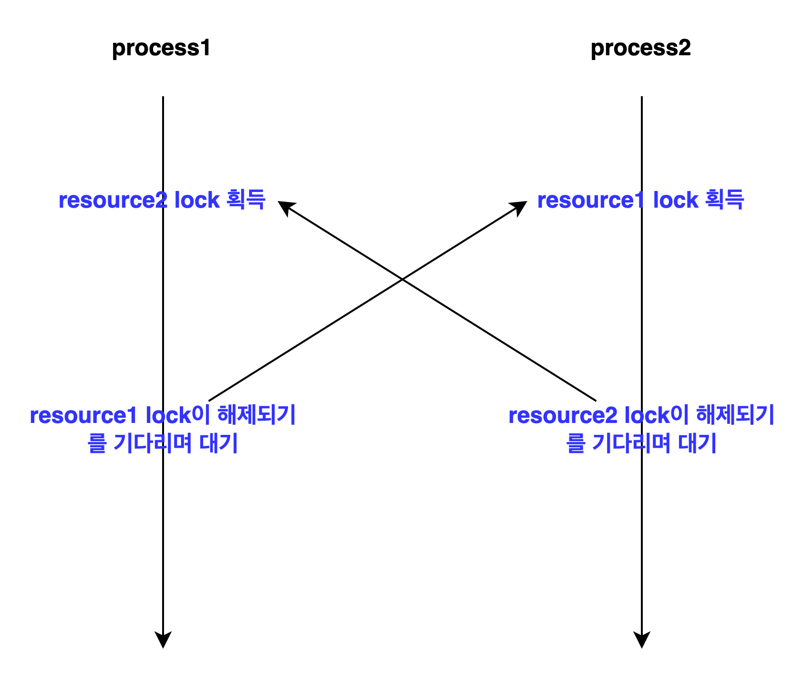

### 데드락

- 데드락이란 두 개 이상의 작업이 서로 상대방의 작업을 끝나기 만을 기다리고 있기 때문에 결과적으로 아무 작업도 완료하지 못하는 상태를 데드락이라 한다.
  - 공유 자원을 다수의 스레드나 프로세스에서 접근하려 할 때, 하나의 스레드나 프로세스만이 해당 자원에 접근할 수 있도록 설계하여 동시성 이슈를 해결하고자 하는데 이때 데드락이 발생할 수 있다.  
  - 데드락이 발생하면 실행중인 프로세스를 종료시키는 방법말고는 딱히 방법이 없고, 해당 문제가 발생하였을 오류를 수정하기도 쉽지 않기 때문에 데드락이 발생하지 않도록 프로그램을 만드는 것이 중요하다.

#### 코드를 통해서 확인해보는 데드락 현상

```java
public class DeadlockTest {

    static class Resource {
        private String name;
        public Resource(String name) {
            this.name = name;
        }

        public void work(){
            try {
                Thread.sleep(1000);
            } catch (InterruptedException e) {
                throw new RuntimeException(e);
            }
        }
        public String getName() {
            return name;
        }
    }

    static class Deadlock implements Runnable {
        private Resource resource1;
        private Resource resource2;

        public Deadlock(Resource resource1, Resource resource2) {
            this.resource1 = resource1;
            this.resource2 = resource2;
        }
        @Override
        public void run() {
            synchronized (resource1) {
                System.out.println(Thread.currentThread().getName() +"이 " + resource1.getName() + "에 대한 작업을 위하여 락을 획득했습니다.");
                resource1.work();

                synchronized (resource2) {
                    System.out.println(Thread.currentThread().getName() +" 이 " + resource2.getName() + "에 대한 작업을 위하여 락을 획득했습니다.");
                    resource2.work();
                }
            }
        }
    }

    public static void main(String[] args) throws InterruptedException {
        Resource resource1 = new Resource("Resource1");
        Resource resource2 = new Resource("Resource2");

        Thread process1 = new Thread(new Worker(resource2, resource1), "Process1");
        Thread process2 = new Thread(new Worker(resource1, resource2), "Process2");

        process1.start();
        process2.start();
    }
}
```
- `process1`은 `resource2`의 작업이 종료되면 `resource1`의 작업을 시작하고, `process2`는 `resource1`의 작업이 종료되면 `resource2`의 작업을 시작하게 된다.
- 멀티 스레드 환경에서의 동시성 이슈를 막기 위하여, `process`는 `resource`에 접근할때 마다 락을 걸고 작업이 종료될때마다 락을 해제한다.
- `process1`이 `resource2`의 락을 해제하기 전에는 `process2`가 `resource2`의 자원에 접근할 수 없고, `process2`가 `resource1`의 락을 해제하기 전애는 `process1`은 `resource1`의 자원에 접근할 수 없도록 코드가 작성되어 있다.



- 해당 코드를 실행하게 되면 위의 그림과 같이 `process1`과 `process2`가 서로 락을 해제하기를 기다리며 결과적으로 아무 작업도 완료하지 못하는 데드락에 바지게 된다.


### 데드락 발생 조건

#### 데드락을 방지하는 방법

- 하나의 스레드가 하나의 락을 사용하지 않는다.
- 락에 타임아웃을 건다.
  - 하나의 스레드가 일정시간 이내에 락을 얻지 못하면 설정된 타임아웃시간 만큼 기다리고 해당작업을 실패하도록


### 데이터베이스에서 발생하는 데드락

- 데이터베이스는 많은 어플리케이션이 커넥션을 맺어 자원에 접근하여 데이터를 읽거나 쓸 수 있다. 때문에 데이터베이스는 동시성 이슈를 해결하기 위하여 락을 제공하고 있으며 데드락이 발생할 수 있다.
> 트랜잭션의 isolation level은 하나의 트랜잭션 단위에서 어떻게 데이터의 정합성을 맞추

#### 데이터베이스 락
- 데이터베이스에는 크게 2가지의 락이 존재한다.
  - Shared Lock(공유락)
    - 다른 트랜잭션에서 Shared Lock은 허용하지만 Exclusive Lock은 허용하지 않는다.
  - Exclusive Lock(베타락)
    - 다른 트랜잭션에서 Shared Lock, Exclusive Lock을 허용하지 않는다.


> https://ko.wikipedia.org/wiki/%EA%B5%90%EC%B0%A9_%EC%83%81%ED%83%9C?source=post_page-----8100261a66c3--------------------------------