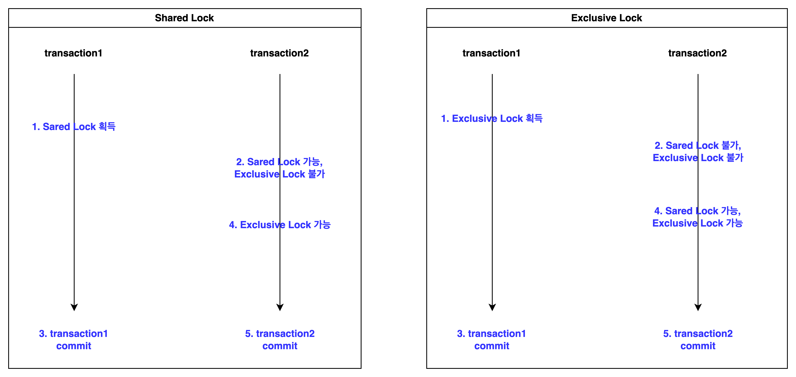

## 1. 데드락
---

- 데드락이란 두 개 이상의 작업이 서로 상대방의 작업을 끝나기 만을 기다리고 있기 때문에 결과적으로 아무 작업도 완료하지 못하는 상태를 데드락이라 한다.
  - 공유 자원을 다수의 스레드나 프로세스에서 접근하려 할 때, 하나의 스레드나 프로세스만이 해당 자원에 접근할 수 있도록 설계하여 동시성 이슈를 해결하고자 하는데 이때 데드락이 발생할 수 있다.  
  - 데드락이 발생하면 실행중인 프로세스를 종료시키는 방법말고는 딱히 방법이 없고, 해당 문제가 발생하였을 오류를 수정하기도 쉽지 않기 때문에 데드락이 발생하지 않도록 프로그램을 만드는 것이 중요하다.

## 2. 데드락 발생이 발생하는 경우
---

- 데드락을 이해하기 위한 가장 좋은 방법은 실제 데드락 현상을 만드는 것이다. 때문에 어떤 경우에 데드락 현상을 직접 구현해보자.

### 2.1 애플리케이션에서 발생하는 경우


```java
public class DeadlockTest {

    static class Resource {
        private String name;
        public Resource(String name) {
            this.name = name;
        }

        public void work(){
            try {
                Thread.sleep(1000);
            } catch (InterruptedException e) {
                throw new RuntimeException(e);
            }
        }
        public String getName() {
            return name;
        }
    }

    static class Worker implements Runnable {
        private Resource resource1;
        private Resource resource2;

        public Worker(Resource resource1, Resource resource2) {
            this.resource1 = resource1;
            this.resource2 = resource2;
        }
        @Override
        public void run() {
            synchronized (resource1) {
                System.out.println(Thread.currentThread().getName() +"이 " + resource1.getName() + "에 대한 작업을 위하여 락을 획득했습니다.");
                resource1.work();

                synchronized (resource2) {
                    System.out.println(Thread.currentThread().getName() +" 이 " + resource2.getName() + "에 대한 작업을 위하여 락을 획득했습니다.");
                    resource2.work();
                }
            }
        }
    }

    public static void main(String[] args) throws InterruptedException {
        Resource resource1 = new Resource("Resource1");
        Resource resource2 = new Resource("Resource2");

        Thread process1 = new Thread(new Worker(resource2, resource1), "Process1");
        Thread process2 = new Thread(new Worker(resource1, resource2), "Process2");

        process1.start();
        process2.start();
    }
}
```
- `process1`은 `resource2`의 작업이 종료되면 `resource1`의 작업을 시작하고, `process2`는 `resource1`의 작업이 종료되면 `resource2`의 작업을 시작하게 된다.
- 멀티 스레드 환경에서의 동시성 이슈를 막기 위하여, `process`는 `resource`에 접근할때 마다 락을 걸고 작업이 종료될때마다 락을 해제한다.
- `process1`이 `resource2`의 락을 해제하기 전에는 `process2`가 `resource2`의 자원에 접근할 수 없고, `process2`가 `resource1`의 락을 해제하기 전애는 `process1`은 `resource1`의 자원에 접근할 수 없도록 코드가 작성되어 있다.


- 해당 코드를 실행하게 되면 위의 그림과 같이 `process1`과 `process2`가 서로 락을 해제하기를 기다리며 결과적으로 아무 작업도 완료하지 못하는 데드락에 바지게 된다.


### 2.2. 데이터베이스에서 발생하는 경우

- 데이터베이스는 많은 어플리케이션이 커넥션을 맺어 자원에 접근하여 데이터를 읽거나 쓸 수 있다. 때문에 데이터베이스는 동시성 이슈를 해결하기 위하여 락을 제공하고 있으며 데드락이 발생할 수 있다.
- 데드락을 이해하기전에 데이터베이스에 어떠한 락을 이용하여 동시성을 제어하는지부터 한번 알아보자.

#### 데이터베이스 락
- 데이터베이스에는 크게 두가지의 락을 이용하여 동시성 이슈를 해결한다.

1. Shared Lock(공유락)
   - 레코드에 Shared Lock을 걸게되면 읽기 잠금을 획득하여 다른 트랜잭션에서 레코드를 변경할 수는 없지만 읽을 수 는 있다.
   - 즉. 다른 트랜잭션에서 Shared Lock은 허용할 수 있지만 Exclusive Lock은 허용하지 않는다.
   - Exclusive Lock을 획득하기 위해서는 Shared Lock이 헤제되어야 획득할 수 있다.
    ```sql
    ------------ transaction1 ------------
    start transaction;

    -- Shared Lock 획득
    select * from lock_test where col1 = 'value1' lock in share mode;

    do sleep(10);

    commit;

    ------------ transaction2 ------------
    start transaction;

    -- transaction1이 Shared Lock을 획득하였지만, transaction2에서도 Shared Lock 획득 가능
    select * from lock_test where col1 = 'value1' lock in share mode;
    -- transaction1이 Shared Lock을 획득하여서, transaction2에서 Exclusive Lock 획득 불가, transaction1이 종료될때까지 기다림
    update lock_test set col1 = 'value3' where col1 = 'value1';

    commit;    
    ```
2. Exclusive Lock(베타락)
   - 레코드에 Exclusive Lock을 걸면 쓰기 잠금을 획득하며 다른 트랜잭션에서 레코드를 읽을 수도 변경할 수도 없다. 
   - 즉, 다른 트랜잭션에서 Shared Lock, Exclusive Lock을 허용하지 않는다.
   - Exclusive Lock, Shared Lock을 획득하기 위해서는 Exclusive Lock이 헤제되어야 획득할 수 있다.
    ```sql
    ------------ transaction1 ------------
    start transaction;

    -- Exclusive Lock 획득
    update lock_test set col1 = 'value3' where col1 = 'value1';

    do sleep(10);

    commit;

    ------------ transaction2 ------------
    start transaction;

    -- transaction1이 Exclusive Lock을 획득하여서, transaction1 종료될때까지 기다림
    select * from lock_test where col1 = 'value1' lock in share mode;
    update lock_test set col1 = 'value3' where col1 = 'value2';

    commit;
    ```


### 데드락 발생 조건

### 데드락을 방지하는 방법


> https://hstory0208.tistory.com/entry/%EB%9D%BDLock%EC%9D%B4%EB%9E%80-Lock%EC%9D%98-%EC%A2%85%EB%A5%98%EC%99%80-%EA%B5%90%EC%B0%A9%EC%83%81%ED%83%9CDeadLock
> https://ko.wikipedia.org/wiki/%EA%B5%90%EC%B0%A9_%EC%83%81%ED%83%9C?source=post_page-----8100261a66c3--------------------------------